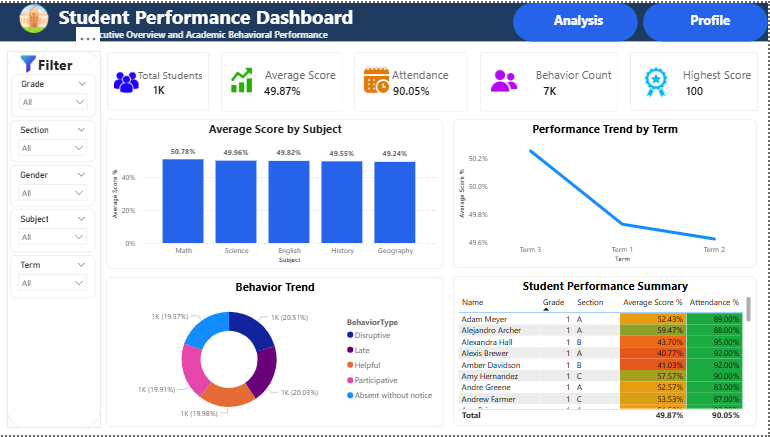
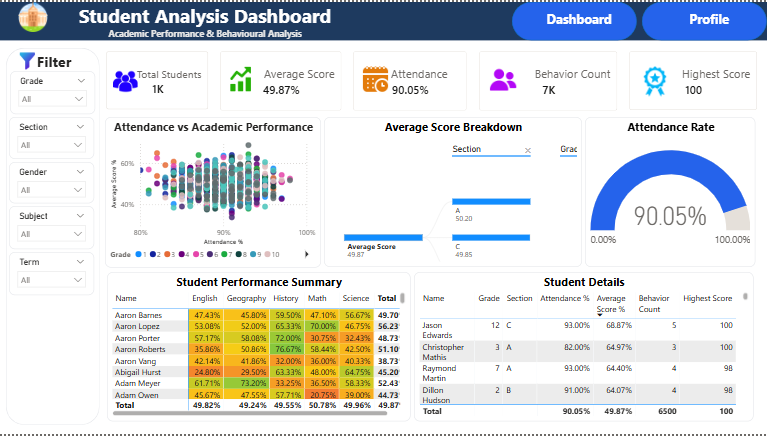
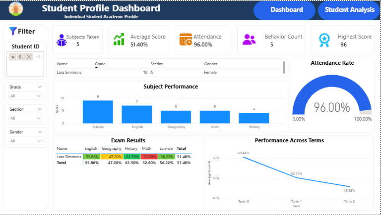

# 🎓 Student Performance Dashboard

> **An interactive Power BI dashboard for monitoring academic
> performance, attendance, and student behavior.**

```{=html}
<p align="center">
```

 


```{=html}
</p>
```

------------------------------------------------------------------------

# 📚 Table of Contents

  Section                Description
  ---------------------- --------------------------------
  🚀 Project Overview    What this dashboard solves
  🛠 Tech Stack           Tools used
  📂 Dataset             Data sources
  🏗 Data Model           Relationships
  📈 Dashboard Pages     Executive, Analysis & Profile
  ⚙️ DAX Measures        Business calculations
  🎯 Key Features        Interactive capabilities
  🧠 Business Insights   What decision makers can learn
  📷 Screenshots         Dashboard preview
  🔄 Workflow            Project flow
  👨‍💻 About Me            Author

------------------------------------------------------------------------

# 🚀 Project Overview

This project was built as a complete end-to-end **Power BI Student
Performance Dashboard**. The objective was to transform raw student,
attendance, behavior and examination data into an interactive reporting
solution that helps educators quickly identify trends, monitor
performance, and analyze individual student progress.

------------------------------------------------------------------------

# 🛠 Tech Stack

  Tool               Purpose
  ------------------ -----------------------
  Power BI Desktop   Dashboard Development
  Power Query        Data Cleaning
  DAX                Measures & KPIs
  CSV Files          Data Source
  GitHub             Version Control

------------------------------------------------------------------------

# 📂 Dataset

    Students
    ├── Students.csv
    ├── Scores.csv
    ├── Attendance.csv
    └── Behavior.csv

------------------------------------------------------------------------

# 🏗 Data Model

``` text
Students
   │
   ├──────── Scores
   ├──────── Attendance
   └──────── Behavior
```

A star-schema model was used with **Students** as the central dimension
table.

------------------------------------------------------------------------

# 📊 Dashboard Pages

## 🏠 1. Executive Dashboard

-   Executive KPIs
-   Subject performance
-   Behavior overview
-   Performance trends
-   Interactive filters



------------------------------------------------------------------------

## 📈 2. Student Analysis Dashboard

-   Attendance vs Academic Performance
-   Attendance Gauge
-   Performance Breakdown
-   Student Summary
-   Student Details



------------------------------------------------------------------------

## 👤 3. Student Profile Dashboard

-   Individual Student Profile
-   Attendance Gauge
-   Subject Performance
-   Exam Results
-   Performance Across Terms



------------------------------------------------------------------------

# ⚙️ DAX Measures

-   Total Students
-   Total Score
-   Highest Score
-   Average Score %
-   Attendance %
-   Attendance Target
-   Behavior Count
-   Subjects Taken

------------------------------------------------------------------------

# 🎯 Features

-   ✅ Interactive slicers
-   ✅ Cross filtering
-   ✅ KPI Cards
-   ✅ Conditional Formatting
-   ✅ Navigation Buttons
-   ✅ Drillable visualizations
-   ✅ Professional layout

------------------------------------------------------------------------

# 🧠 Business Value

This dashboard enables users to:

-   📌 Identify top and low-performing students
-   📌 Compare subject performance
-   📌 Monitor attendance
-   📌 Track student behavior
-   📌 Analyze academic trends
-   📌 Review an individual student's profile

------------------------------------------------------------------------

# 🔄 Project Workflow

``` text
CSV Files
    │
    ▼
Power Query
    │
    ▼
Data Cleaning
    │
    ▼
Data Model
    │
    ▼
DAX Measures
    │
    ▼
Interactive Dashboards
    │
    ▼
Business Insights
```

------------------------------------------------------------------------

# 📁 Repository Structure

``` text
Student-Performance-Dashboard/
│
├── Assets/
├── Data sets/
├── Screenshots/
│   ├── Executive_Dashboard.png
│   ├── Student_Analysis.png
│   └── Student_Profile.png
├── Student Performance Dashboard.pbix
└── README.md
```

------------------------------------------------------------------------

# 💡 What I Learned

-   Designing a star schema
-   Writing reusable DAX measures
-   Building professional KPI dashboards
-   Creating interactive reports
-   Applying consistent UI/UX principles
-   Using GitHub to showcase BI projects

------------------------------------------------------------------------

# 👨‍💻 About Me

I'm an aspiring **Data Analyst / Business Intelligence Developer**
passionate about transforming data into actionable insights. This
project reflects my ability to build end-to-end Power BI solutions using
data modeling, DAX, visualization, and dashboard design.

⭐ If you found this project interesting, feel free to star the
repository!
